# Izveštaj sprovedene analize

Korišćeni alati:
- [Cppcheck](#cppcheck)
- [Clang-tidy](#clang-tidy)
- [Valgrind alati](#valgrind)
    - [Memcheck](#memcheck)
    - [Callgrind](#callgrind)
- [Perf](#perf)
- [Strace](#strace)

## Cppcheck

**Cppcheck** je alat koji se koristi za statičku analizu koda pisanog u C i C++ programskom jeziku. Njegova osnovna svrha je otkrivanje grešaka u kodu kao što su potencijalni problemi sa memorijom (npr. curenje memorije), dereferenciranje null pokazivača, buffer overflow-i, korišćenje neinicijalizovanih varijabli, i druge vrste grešaka koje mogu proći neopaženo tokom kompajliranja ili izvršavanja programa. Alat je za statičku analizu - analizira kod bez njegovog izvršavanja.
Alat se pokreće nad source fajlovima.

Za instalaciju *Cppcheck* alata potrebno je u terminalu pokrenuti sledeću komandu:
```
sudo apt-get install cppcheck
```

Dodatne opcije koje su korišćene prilikom analize koda posmatranog projekta:
- *--inconclusive* : alat prijavljuje i neodređene ili potencijalne greške (greške koje nije mogao da kategorizuje kao greške ili upozorenja i bez ove opcije ih ne bi uključio u izveštaj)
- *--enable=all* : alat uključuje sve dostupne provere (analize) koje može da izvrši
- *--suppress=missingInclude* : alat ignoriše greske koje se dobijaju iz *header*-a (kako bi se izbegao problem sa proveravanjem eksternih biblioteka koje se uključuju u *header* fajlovima)
- *--output-file="cppcheck-output.txt"* : rezultat koji se dobija analizom biće upisan u fajl *cppckeck-output.txt*
- *-I <header_dir>"* : dodaje direktorijum za zaglavlja koja se uključuju prilikom analize

Komanda na kraju izgleda ovako:
```
cppcheck --inconclusive --enable=all --suppress=missingInclude --output-file="cppcheck-output.txt" -I ../19-under-the-c/UNDER_THE_C/Headers/ ../19-under-the-c/UNDER_THE_C/Sources/*
```

Pokreće se pomoću [skripte](cppcheck/cppcheck.sh):
```
./cppcheck.sh
```

Kompletan izveštaj dobijen primenom *cppcheck* alata nalazi se u fajlu [*cppcheck-output.txt*](cppcheck/cppcheck-output.txt).
Ono što je dobro jeste da nije pronađeno mnogo greški u svakom  od 61 fajla koliko je analizirano alatom.
Primera iz dobijenog izveštaja:

* > 19-under-the-c/UNDER_THE_C/Headers/Score.h:9:5: Class 'Score' has a constructor with 1 argument that is not explicit. [noExplicitConstructor]
        Score(int t);

   **Komentar:** Alat upozorava da konstruktor ima samo jedan parametar i nije označen sa `explicit` tako da C++ kompajler može koristiti taj konstruktor za implicitne konverzije. To je problem jer kompajler može automatski pretvoriti tipove podataka bez eksplicitne dozvole.


* > 19-under-the-c/UNDER_THE_C/Sources/Music.cpp:16:9: There is an unknown macro here somewhere. Configuration is required. If foreach is a macro then please configure it.
        foreach(auto music, musics)

   **Komentar:** Alat kaže da nije uspeo da prepozna il pravilno interpretira makro (`foreach`) koji se koristi u kodu

* > 19-under-the-c/UNDER_THE_C/Sources/MenuScene.cpp:17:0: The function 'play' is never used. [unusedFunction]

     **Komentar:** Alat kaže da u kodu postoji deklarisana funkcija koja se nigde ne koristi.


## Clang-Tidy

**Clang-Tidy** predstavlja jedan od *Clang* zasnovanih alata koji obavlja statičku analizu koda (vrši analiziranje izvornog koda bez njegovog izvršavanja sa ciljem pronalaženja grešaka, poboljšanja kvaliteta koda i ispravljanja neoptimalno napisanih delova koda). **Clang-Tidy** je *C++* linter alati koji analizira kod i pronalazi programske i stilske greške unutar koda.

Ovaj alat je integrisan u okviru *QtCreator*-a i njegova upotreba je opisana u nastavku.
Da bi se analiza izvršila potrebno je napraviti *custom* konfiguraciju. Default konfiguracija je takva da se ne može menjati.
* Dodavanje *custom* konfiguracije:
   - Izabrati karticu *Edit* i u njoj izabrati *Preferences* iz padajućeg menija.
   - U listi sa leve strane izabrati stavku *Analyzer*.
   - U okviru ovog prozora može se dodati nova konfiguracija.
   - Dodavanje nove konfiguracije dato je na slici:
        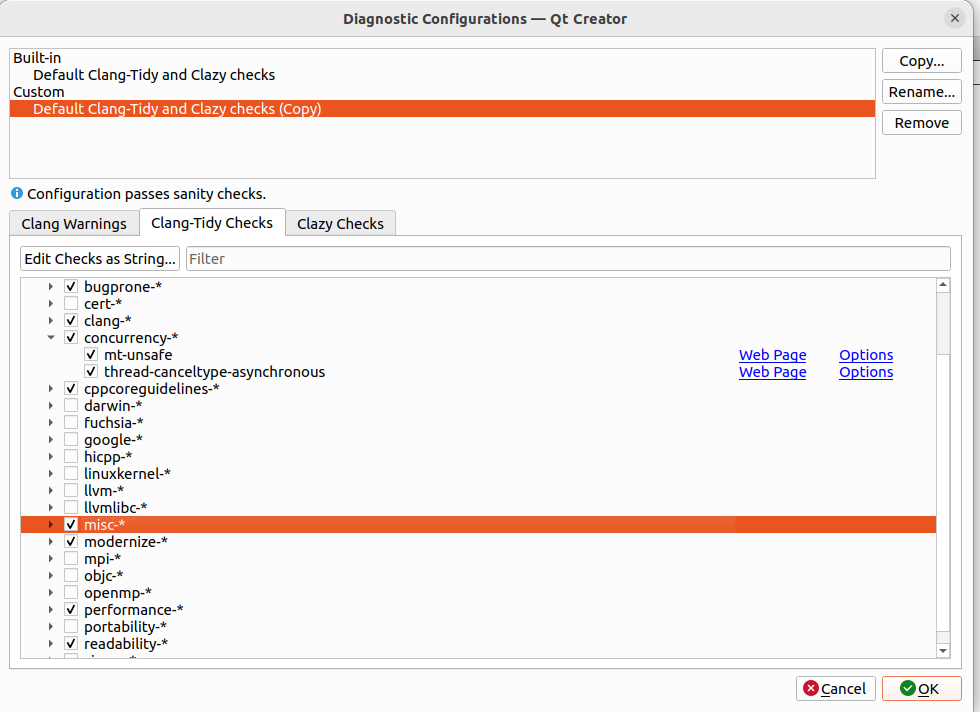

Nakon pravljenja odgovarajuće konfiguracije, pokrećemo alata:
* Izabrati karticu *Analyze*, a zatim odabrati alat *Clang-Tidy* iz padajućeg menija.
   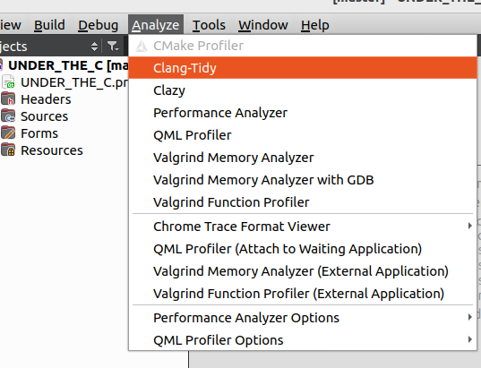

* Izabrati fajlove nad kojima želimo da primenimo analizu.
    - Header fajlovi:
        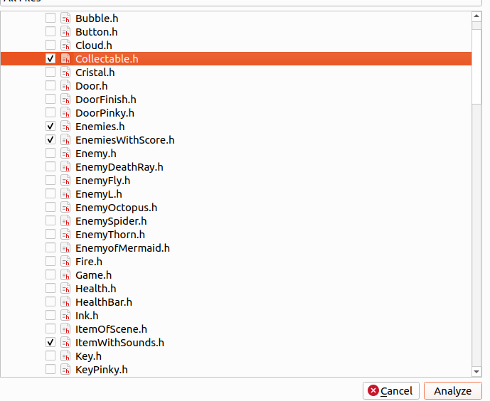
    - Source fajlovi:
        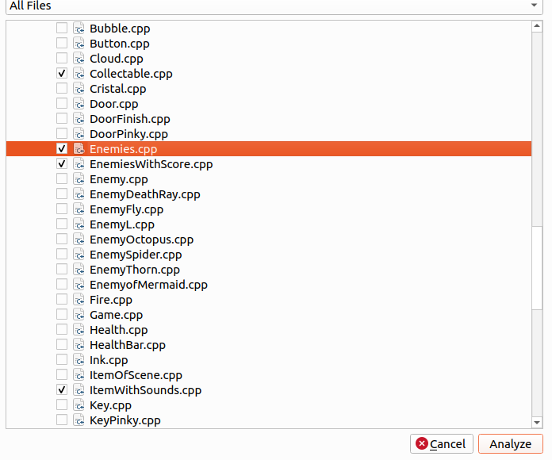

* Klikom na dugme *Analyze* pokreće se analiza nad izabranim fajlovima.
* Dobijen je sledeći rezultat.
  - Header fajlovi:
        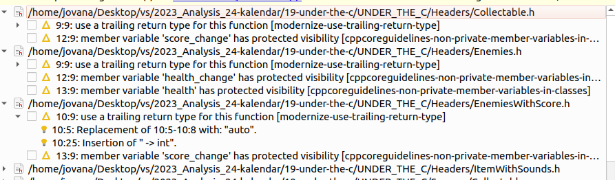
  - Source fajlovi:
        [img](clang-tidy/diag_sources.PNG)

Analiza je dala sledeće outpute:
*  

    **Komentar:** Alat preporučuje upotrebu *trailing return* tipa, koji podrazumeva da je tip povratne vrednosti naveden nakon liste argumenata funkcije, koristeći *auto* za automatsko određivanje tipa

*  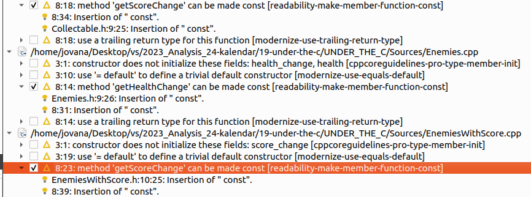

    **Komentar:** Alat sugeriše da metoda može biti označena kao *const* jer ne menja stanje objekta na kojem se poziva

*  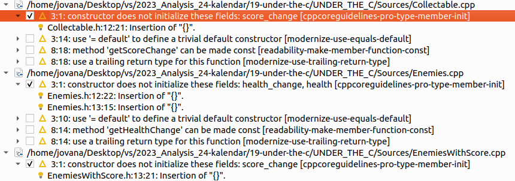

    **Komentar:** Upozorenje da konstruktor klase neinicijalizuje sve članske promenljive ili podatke koje bi trebalo inicijalizovati

*  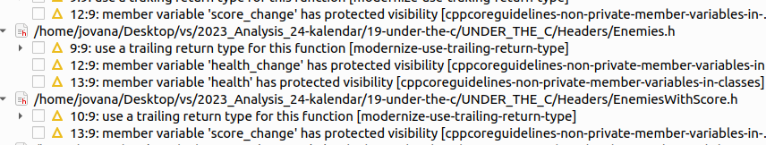

    **Komentar:** Upozorenje na *protected* vidljivost članova klase koje je signalizirano jer je član previše izložen ili je potrebo da bude bolje enkapsuliran.


## Valgrind alati

Valgrind je moćan alat za profilisanje i otkrivanje grešaka u memoriji u C, C++ i sličnim jezicima. Najčešće se koristi za detekciju problema vezanih za alokaciju i upravljanje memorijom, prisup neinicijalizovanim memorijskim lokacijama ili pokušaji pisanja/čitanja izvan granica alocirane memorije.

Valgrind obuhvata sledeće alate:
* *Memcheck* (detektor memorijskih grešaka)
* *Massif* (praćenje rada dinamičke memorije)
* *Callgrind* (profajler poziva funkcija)
* *Cachegrind* (profajler keš memorije)
* *Hellgrind* i *DRD* (detektori grešaka u radu sa nitima)

Za instalaciju *Valgrind* alata potrebno je u terminalu pokrenuti sledeću komandu:
```
sudo apt-get install valgrind
```

U okviru projekta analiza je rađena pomoću alata *Memcheck* i *Callgrind*.


### Memcheck

**Memcheck** je alat koj se koristi se za detektovanje memorijskih grešaka i sprovođenja analize nad mašinskim kodom.
Upotrebom *Memcheck*-a mogu se otkriti različite vrste problema, kao što su curenja memorije, pristup ili upisivanje vrednosti van opsega, korišćenje neinicijalizovanih vrednosti, pristup već oslobođenoj memoriji, dvostruko oslobađanje meorije itd.

Dodatne opcije koje su korišćene prilikom analize:
-*--tool=memchek* : za pokretanje memchek alata
- *--leak-check=full* : daje informacije o svim definitivno izgubljenim ili potencijalno izgubljenim blokovima, uključujući i informacije o njihovoj alokaciji
- *--show-lead-kinds=all* : prikazuje sve vrse curenja memorije u programu
- *--track-origins=yes* : omogućava lakše pronalaženje dela programa u kom se nalazi memoriski propust (može usporiti rad alata)
- *--verbose* : daje dodatne informacije o procesu koji se izvršava
- *--log-file="(date +%s).memcheck.o"* : rezultati analize će biti upisani u *(date)-memcheck.txt* fajl za više različitih pokretanja alata

Pre pokretanja komande potrebno je prevesti program u **Debug** režimu.

Komanda kojom je pokrenuta analiza:
```
valgrind --tool=memcheck --leak-check=full --show-leak-kinds=all --track-origins=yes --verbose --log-file="$(date +%s).memcheck.out" ../19-under-the-c/UNDER_THE_C/build/Desktop_Qt_5_15_1_GCC_64bit-Debug/UNDER_THE_C
```

Pokreće se pomoću [skripte](/memcheck/memcheck.sh):
```
./memcheck.sh
```

Kompletan izveštaj dobijen primenom *Memcheck* alata nalazi se, između ostalih, u fajlu [*memcheck.out*](/memcheck/1724273195.memcheck.out).

Primeri iz izveštaja:
(`77277` je PID):
```
==77277== ERROR SUMMARY: 14 errors from 14 contexts (suppressed: 0 from 0)
==77277==
==77277== 1 errors in context 1 of 14:
==77277== Invalid read of size 8
==77277==    at 0x40286A8: strncmp (strcmp.S:172)
==77277==    by 0x400668D: is_dst (dl-load.c:216)
==77277==    by 0x400810E: _dl_dst_count (dl-load.c:253)
==77277==    by 0x400810E: expand_dynamic_string_token (dl-load.c:395)
==77277==    by 0x40082B7: fillin_rpath.isra.0 (dl-load.c:483)
==77277==    by 0x4008602: decompose_rpath (dl-load.c:654)
==77277==    by 0x400ABF5: cache_rpath (dl-load.c:696)
==77277==    by 0x400ABF5: cache_rpath (dl-load.c:677)
==77277==    by 0x400ABF5: _dl_map_object (dl-load.c:2165)
==77277==    by 0x4003494: openaux (dl-deps.c:64)
==77277==    by 0x6D96A97: _dl_catch_exception (dl-error-skeleton.c:208)
==77277==    by 0x4003C7B: _dl_map_object_deps (dl-deps.c:248)
==77277==    by 0x400EA0E: dl_open_worker_begin (dl-open.c:592)
==77277==    by 0x6D96A97: _dl_catch_exception (dl-error-skeleton.c:208)
==77277==    by 0x400DF99: dl_open_worker (dl-open.c:782)
```
**Komentar:** Dati deo izveštaja ukazuje na problem sa nevažećim čitanjem memorije. Ovo znači da program pokušava da pročita 8 bajta podataka iz memorijske lokacije koja nije validna za tu operaciju. Greška se dogodila unutar funkcije `strncmp` u `strcmp`. Pratilac poziva prikazuje niz funkcija koje su dovele do ove greške.

Ukupan broj ovakvih greški je po izveštaju 14 u 14 različitih funkcija (konteksta). Ovo su greške koje je alat detektovao prilikom izvršavanja programa. Greške uključuju nevalidna čitanja ili pisaja u memoriju, curenje memorije, nepravilno oslobađanje memorije itd.

```
==77277== LEAK SUMMARY:
==77277==    definitely lost: 20,248 bytes in 27 blocks
==77277==    indirectly lost: 10,224 bytes in 51 blocks
==77277==      possibly lost: 2,176 bytes in 5 blocks
==77277==    still reachable: 46,204,004 bytes in 45,171 blocks
==77277==         suppressed: 0 bytes in 0 blocks
```

Primer steka poziva:
```
==77277== 16 bytes in 1 blocks are still reachable in loss record 1,938 of 13,585
==77277==    at 0x4849013: operator new(unsigned long) (in /usr/libexec/valgrind/vgpreload_memcheck-amd64-linux.so)
==77277==    by 0x62F84E5: QtSharedPointer::ExternalRefCountData::getAndRef(QObject const*) (qsharedpointer.cpp:1403)
==77277==    by 0x5948B75: QWeakPointer<QObject, 1u> (qsharedpointer_impl.h:679)
==77277==    by 0x5948B75: assign<QObject> (qsharedpointer_impl.h:675)
==77277==    by 0x5948B75: operator= (qpointer.h:74)
==77277==    by 0x5948B75: QAccessibleObject::QAccessibleObject(QObject*) (qaccessibleobject.cpp:81)
==77277==    by 0x518D201: QAccessibleWidget::QAccessibleWidget(QWidget*, QAccessible::Role, QString const&) (qaccessiblewidget.cpp:208)
==77277==    by 0x518EC13: qAccessibleFactory(QString const&, QObject*) (qaccessiblewidgetfactory.cpp:122)
==77277==    by 0x5941A67: QAccessible::queryAccessibleInterface(QObject*) (qaccessible.cpp:690)
==77277==    by 0x594249E: QAccessibleEvent::accessibleInterface() const (qaccessible.cpp:1764)
==77277==    by 0x594299C: QAccessible::updateAccessibility(QAccessibleEvent*) (qaccessible.cpp:862)
==77277==    by 0x4F9E268: QWidgetPrivate::show_helper() (qwidget.cpp:7823)
==77277==    by 0x4FA1203: QWidgetPrivate::setVisible(bool) (qwidget.cpp:8111)
==77277==    by 0x4F9E08F: QWidgetPrivate::showChildren(bool) (qwidget.cpp:8183)
==77277==    by 0x4F9E0FE: QWidgetPrivate::show_helper() (qwidget.cpp:7768)
```

**Komentar:** Iz dela sažetka možemo videti da ima dosta primera curenja memorije (definitivno izgubljene, inidirektno izgubljene i moguće izgubljene memorije) - deo izveštaja `LEAK SUMMARY`.
Iz primera steka poziva funkcija vidimo problem koji se odnosi na problem `još dostupne` memorije. 16 bajtova memorije je alocirano u jedom bloku, ali ta memorija nije oslobođena do trenutka kada je program završio izvršavanje. Memorija je alocirana korišćenjem operatora `new` kao standardne operacije C++. Niz fja koji slede pokazuju da se memorija alocirala u:  `QtSharedPointer::ExternalRefCountData::getAndRef(QObject const*)` i `QAccessibleObject::QAccessibleObject(QObject*)`.

Generalno, u izveštaju postoji dosta `still reachable` greški koje ukazuju na loše upravljanje memorijom i neefikasno korićenje resursa.


### Callgrind

**Callgrind** je alat za profajliranje koji čuva istoriju poziva funkcija u programu kao graf poziva.\
Neke od informacija koje se mogu dobiti za zadati program su:
* broj izvršenih instrukcija
* odnosi izvršenih instrukcija sa odgovarajućim linijama koda
* caller/callee odnos između funkcija (sa frekvencijama)
* informacije o keširanju (promašaji, pogodci, ...)

Dodatne opcije koje su korišćene prilikom analize:
- *--tool=callgrind* : specifiramo koji Valgrind alat koristimo
- *--keep-debuginfo=yes* : opcija koja osigurava da Callgrind zadrži debug informacije tokom rada koje su neophodne za povezivanje prikupljenih podataka sa linijama koda i funkcijama u programu
- *--callgrind-out-file=callgrind-%p.out* : specificiramo ime izlaznog fajla u koji će Callgrind upisati rezultate profilisanja *callgrind-PID.out*
- *--log-file="calgrind-%p.txt"* : rezultati analize će biti upisani u *callgrind-PID.txt* fajlu
- *--dump-instr=yes* : opcija koja omogućava beleženje informacija o instrukcijama koje se izvršavaju - koje se instrukcije izvode i koliko često
- *--collect-jumps=yes* : opcja koja omogućava prikupljanje podataka o skokovima unutar koda, kao što su skokovi na osnovu grananja ili petlji
- *--simulate-cache=yes* : uključuje simulaciju keš memorije procesora

Pre pokretanja komande potrebno je prevesti program u **Profile** režimu.

Komanda kojom je pokrenuta analiza izgleda ovako:
```
valgrind --tool=callgrind  --keep-debuginfo=yes --callgrind-out-file="callgrind-%p.out" --log-file="callgrind-%p.txt" --dump-instr=yes --collect-jumps=yes --simulate-cache=yes ../19-under-the-c/UNDER_THE_C/build/Desktop_Qt_5_15_1_GCC_64bit-Profile/UNDER_THE_C
```

Pokreće se pomoću [skripte](callgrind/callgrind.sh):
```
./callgrind.sh
```

Kao rezultat analize, dobijen je *callgrind-PID.txt* report fajl.
Kako je dodata opcija za simulaciju keš memorije, u reportu će se prikazati simulicija memorije mašine (koju se dobija promenom alata `cachegrind`), koja ima prvi nivo keš memorije podeljene u dve odvojene nezavisne sekcije: I1 - sekcija keš memorije u koju se smeštaju instrukcije D1 - sekcija keš memorije u koju se smeštaju podaci. Drugi nivo keš memorije koja se simulira je objedinjen - LL, skraćeno od eng. last level.

Pored .txt fajla, kao output se dobija i [*callgrind-109531.out*](callgrind/callgrind-109531.out)
*callgrind.out.11677* moze se otvoriti pomoću **KCachegrind** pomoćnog alata za vizuelizaciju.
**KCachegrind** alat se instalira pokretanjem komande:
```
sudo apt-get install kcachegrind
```
Prikaz *Calle Map* i *Calles* za funkciju *Game::initialize()*:

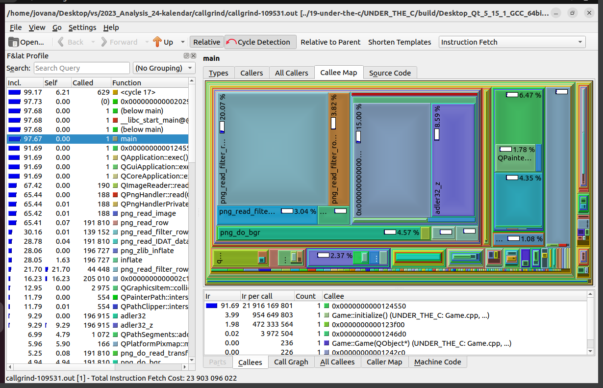

Na sledećoj slici je prikazana lista svih funkcija koje su se pozivale od pokretanja programa, kao i graf poziva funkcija.

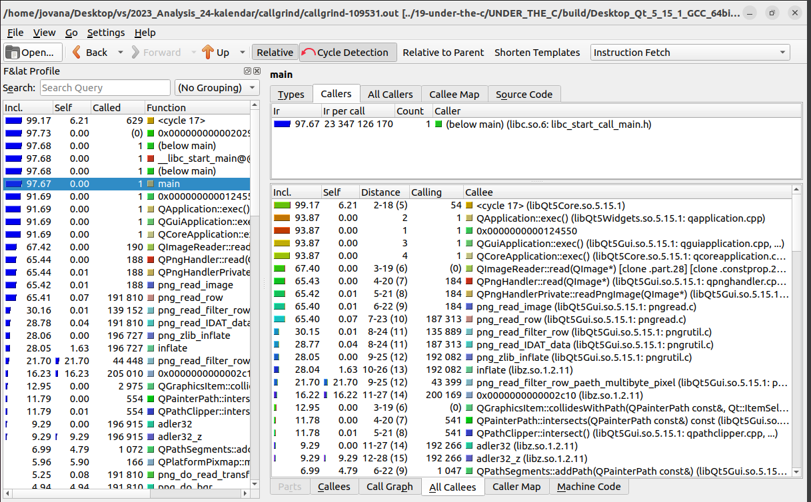
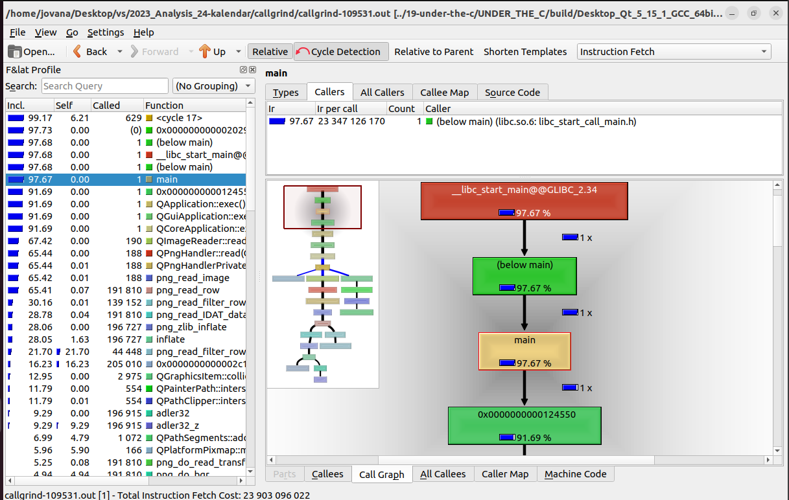

**Komentar:** Izveštaj na osnovu kcachegrinda pokazuje da su se najvećim delom izvršavanja pozivale funkcije implemetirane od strane programera, sistemskih poziva je manje.

## Perf

Alat *Perf* predstavlja moćan alat za analizu performansi na Linux operativnim sistemima. Ovaj alat omogućava programerima da analiziraju performanse njihovog koda kako bi identifikovali potencijalne uzroke usporenja ili probleme sa resursima.
Glavna upotreba alata *Perf* je identifikacija i eliminacija uskih grla u performansama softverskog sistema. On se takođe koristi i za praćenje događaja na nivou kernela i korisničkog prostora (keš promašaji, instrukcie i ciklusi, sistemski pozivi itd.). Kroz analizu podataka o vremenu izvršavanja programeri mogu pronaći delove koda koji zahtevaju optimizaciju, kao i lokacije gde se resursi (CPU, memorija, disk itd.) troše neefikasno.

Za instalaciju *Perf*-a je potrebno pokrenuti komandu koja instalira linux-tools paket za trenutnu verziju jezgra ($(uname -r)), što takođe uključuje i alat Perf.

```
sudo apt-get install linux-tools-$(uname -r)
```

Dodatne opcije koje su korišćene prilikom analize:
- *record* : podkomanda alata perf koja pokrece profilisanje i snima podatke o performansama u fajl (beleži sve relevantne događaje - promašaje keša, instrukcije, cikluse itd)
- *--call-graph dwarf* : ova opcija koristi DWARF debug informacije za generisanje poziva funkcija (call graph)

Pre pokretanja komande potrebno je prevesti program u **Profile** režimu.

Komanda kojom je pokrenuta analiza izgleda ovako:
```
sudo perf record  --call-graph dwarf ../19-under-the-c/UNDER_THE_C/build/Desktop_Qt_5_15_1_GCC_64bit-Profile/UNDER_THE_C
sudo perf report
```

Pokreće se pomoću [skripte](perf/perf.sh):
```
./perf.sh
```
Na slici ispod je prikazan izveštaj dobijen pokretanjem perf alata.

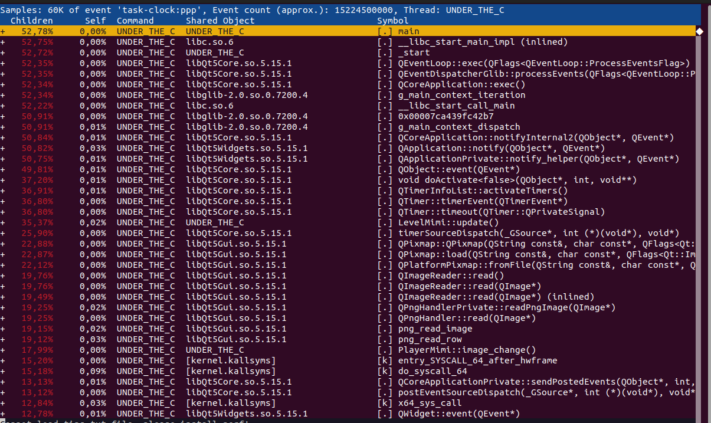

Kolona "*Self*" prikazuje procenat vremena provedenog direktno u trenutnoj funkciji u odnosu na ukupno vreme izvršavanja programa.
Gledajući izveštaj, vidimo da nemamo funkcije koje preveliki procenat vremena troše u svom sopstvenom kontekstu, u svom samom izvršavanju.

U koloni "*Children*" vidimo procente koji prikazuju ukupno procesorsko vreme koje su potrošili svi potomci funkcije (uključujući samu funkciju i sve funkcije koje ona direktno ili indirektno poziva). Ova vrednost prikazuje koliki je doprinos pozvanih funkcija ukupnom vremenu provedenom u trenutnoj funkciji.
Gledajući izveštaj, očekivano je da je broj izvršavanja potomaka glavne funkcije *main* najveći. Takođe, postoji još par funkcija, pisanih od strane autora projekta, gde se može razmotriti optimizaciju broja poziva. Međutim, to su glavne funkcije koje se pozivaju najvećim delom celog izvršavanja programa, tako je procenat očekivan.

U kombinaciji sa alatom *Perf* koristi se često *FlameGraph* - moćan alat za vizualizaciju. FlameGraph pruža intuitivan prikaz vremena izvršavanja različitih delova koda u obliku "*plamenog grafa*".
Ovaj grafički prikaz olakšava identifikaciju glavnih uzroka usporenja i olakšava optimizaciju koda. Pruža intuitivan način da se identifikuju uska grla u performansama i uoče funkcije koje najviše doprinose ukupnom opterećenju CPU-a.
Kada se koristi zajedno sa *Perf* alatom, *FlameGraph* omogućava programerima da brzo identifikuju gde se resursi troše i koje funkcije uzimaju najviše vremena tokom izvršavanja programa.
Potrebno je klonirati github repozitorijum i dodati ga kao submodule.
```
git clone https://github.com/brendangregg/FlameGraph
```

Za dobijenje "*plamenog grafa*" neophodno je pokrenuti [skriptu](perf/generate_flamegraph.sh)
U skripti se najpre definišu varijable. Nakon toga se vrši provera da li su definisane određene varijable.
Komandom:
```sh
sudo perf record -F 99 -g -- $TARGET_APP
```
pokreće se profilisanje aplikacije pomoću alata perf.
Opcije:
- `-F 99` - frekvencija sampliranja u Hz (visoke frekvencije koštaju više, 99Hz ne bi trebalo da utiče na izvršavanje)
- `-g` - uključivanje informacija o stekovima (_stack traces_); opcija `-g` prima opcioni argument koji predstavlja metod razvijanja steka
- `--` - preskače opcioni metod opcije `-g`

Dalje se generiše output skripte u datoteku `out.perf`.
Sledeća komanda koristeći perl skriptu transformiše tekstualni izlaz iz `perf script` u folded stack format pogodan za generisanje `FlameGraph`-a.
Nakon toga se generiše sam `plameni graf` u .svg datoteci i brišu se privremeni fajlovi.

U nastavku vidimo "*plameni graf*" dobijen na osnovu uzimanja uzorka alatom *Perf*.

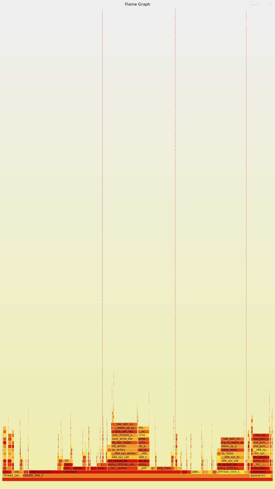

Dijagram prikazuje populaciju uzoraka na x osi, a dubinu steka na y osi. Svaka funkcija je jedan pravougaonik, širine relativne broju uzoraka.


## Strace

Alat *Strace* predstavlja alat za raćenje sistemskih poziva (syscall) i signala koje izvršava proces u UNIX ili Linux operativnom sistemu. To je moćan alat za dijagnostiku, otklanjanje grešaka i razumevanje ponašanja aplikacije i sistema. On se koristi za praćenje komunikacije aplikacije sa sistemom, posebno kada se istražuju roblemi vezani za performanse, dozvole ili druge probleme na nivou sistema.

Za instalaciju *Strace*-a je potrebno pokrenuti sledeću komandu

```
sudo apt-get install strace
```

Pre pokretanja komande program je preveden u **Debug** režim.

Dodatne opcije koje su korišćene prilikom analize:
- *-o strace_output_$(date +%Y%m%d_%H%M%S).txt* : upisuje izlaz strace-a u fajl strace_output_date.txt

Alat je pokrenut pomocu [skripte](strace/strace.sh):
```
./strace.sh
```

Na početku skripte su definisane neke globalne promenljive.
Skipta sadrži poziv:
```
strace -o "$output_file" "$program"
```
Njime se pokreće alat *strace*.

Kompletan izveštaj dobijen primenom *strace* alata nalazi se u fajlu [*strace.output*](/strace/strace_output_20240821_234501.txt).

Neki od primera iz izveštaja:
```
arch_prctl(0x3001 /* ARCH_??? */, 0x7fff89e1bc70) = -1 EINVAL (Invalid argument)
mmap(NULL, 8192, PROT_READ|PROT_WRITE, MAP_PRIVATE|MAP_ANONYMOUS, -1, 0) = 0x780fdf428000
access("/etc/ld.so.preload", R_OK)      = -1 ENOENT (No such file or directory)
openat(AT_FDCWD, "/home/jovana/Qt/5.15.1/gcc_64/lib/glibc-hwcaps/x86-64-v2/libQt5Multimedia.so.5", O_RDONLY|O_CLOEXEC) = -1 ENOENT (No such file or directory)
newfstatat(AT_FDCWD, "/home/jovana/Qt/5.15.1/gcc_64/lib/glibc-hwcaps/x86-64-v2", 0x7fff89e1ae90, 0) = -1 ENOENT (No such file or directory)
openat(AT_FDCWD, "/home/jovana/Qt/5.15.1/gcc_64/lib/tls/x86_64/x86_64/libQt5Multimedia.so.5", O_RDONLY|O_CLOEXEC) = -1 ENOENT (No such file or directory)
```

**Komentar:** Dati primer pokazuje da aplikacija pokušava da učita biblioteku `libQt5Multimedia.so.5` iz nekoloko različitih putanja, kao deo dinamičkog učitavanja i optimizacije performansi. Međutim, nijedna od navedenih lokacija ne sadrži traženi fajl, što rezultira nizom grešaka `ENOENT`. Takođe proces vrši alokaciju memorije i pokušava da konfiguriše arhitektru procesora, ali sa nevažećim argumentom `arch_prctl`, što može ukazivati na nekompatabilnosti ili problem u konfiguraciji.

```
poll([{fd=3, events=POLLIN|POLLOUT}], 1, -1) = 1 ([{fd=3, revents=POLLOUT}])
writev(3, [{iov_base="\202\3\n\0\16\0\340\0\300\4\340\0\0\5\320\2\363\4\1\0\f\0\22\0\363\4\1\0\30\2\0\0"..., iov_len=632}], 1) = 632
poll([{fd=5, events=POLLIN}, {fd=6, events=POLLIN}, {fd=13, events=POLLIN}, {fd=15, events=POLLIN}, {fd=22, events=POLLIN}, {fd=24, events=POLLIN}, {fd=31, events=POLLIN}, {fd=33, events=POLLIN}, {fd=35, events=POLLIN}, {fd=37, events=POLLIN}, {fd=39, events=POLLIN}, {fd=41, events=POLLIN}, {fd=43, events=POLLIN}, {fd=45, events=POLLIN}, {fd=47, events=POLLIN}], 15, 0) = 1 ([{fd=5, revents=POLLIN}])
read(5, "\t\0\0\0\0\0\0\0", 16)         = 8
poll([{fd=3, events=POLLIN|POLLOUT}], 1, -1) = 1 ([{fd=3, revents=POLLOUT}])
writev(3, [{iov_base="+\0\1\0", iov_len=4}], 1) = 4
futex(0x7fff89e1ad68, FUTEX_WAIT_BITSET_PRIVATE|FUTEX_CLOCK_REALTIME, 0, NULL, FUTEX_BITSET_MATCH_ANY) = 0
futex(0x6347ac1277c8, FUTEX_WAKE_PRIVATE, 1) = 0
poll([{fd=3, events=POLLIN|POLLOUT}], 1, -1) = 1 ([{fd=3, revents=POLLOUT}])
writev(3, [{iov_base="<\0\2\0\301\4\340\0007\0\5\0\302\4\340\0\6\0\340\0\0\0\1\0\0\0\0\0;\3\5\0"..., iov_len=864}], 1) = 864
write(5, "\1\0\0\0\0\0\0\0", 8)         = 8
```

**Komentar:** Dati primer pokazuje praćenje sistemskih poziva koje izvršava pokrenut proces. Operacija *poll* čeka na fajl deskriptor 3 da postane spreman za čitanje/pisanje. Vidimo da je na početku iz fd 3 uspešno pisano 632 bajta. Naredni read poziv, umesto 16, čita 8 bajtova sa fd 5. Write pozivi uspešno upisuju bajtove na prosleđene fajl deskriptore. Aplikacija koristi *futex* operaciju za međusobnu sinhronizaciju niti, što ukazuje na višeniti program koji aktivno komunicira sa više fajl deskriptora ili socket-a.
```
futex(0x7fff89e1b164, FUTEX_WAIT_PRIVATE, 2147483717, NULL) = -1 EAGAIN (Resource temporarily unavailable)
futex(0x7fff89e1b164, FUTEX_WAIT_PRIVATE, 2147483720, NULL) = -1 EAGAIN (Resource temporarily unavailable)
futex(0x7fff89e1b164, FUTEX_WAIT_PRIVATE, 2147483721, NULL) = -1 EAGAIN (Resource temporarily unavailable)
futex(0x7fff89e1b164, FUTEX_WAIT_PRIVATE, 2147483723, NULL) = 0
futex(0x7fff89e1b164, FUTEX_WAIT_PRIVATE, 2147483734, NULL) = -1 EAGAIN (Resource temporarily unavailable)
newfstatat(AT_FDCWD, "/etc/localtime", {st_mode=S_IFREG|0644, st_size=1920, ...}, 0) = 0
newfstatat(AT_FDCWD, "/etc/localtime", {st_mode=S_IFREG|0644, st_size=1920, ...}, 0) = 0
newfstatat(AT_FDCWD, "/etc/localtime", {st_mode=S_IFREG|0644, st_size=1920, ...}, 0) = 0
```

**Komentar:** Dati primer pokazuje nekoliko poziva *futex* i *newstatat* operacija. *futex* vrši sinhornizaciju niti na osnovu vrednosti 2147483717 na koju treba biti promenljiva postavljena u memoriji. U prva tri slučaja povratna vrednost je *EAGAIN* što ukazuje da je resurs trenutno nedostupan, nije moguće izvršiti čekanje jer je promenljiva promenila vrednost pre nego što je nit imala šansu da zaspi. Povratna vrednost 0 ukazuje da je čekanje bilo uspešno i da je nit probuđena kad je promenljiva promenjena. Ukratko, prikazana je kombinacija pokušaja niti da sinhronizuju pristup određenim resursima (niti čekaju ili pokušavaju da sinhronizuju pristup memorijskoj lokaciji). *newfstat* su pozivi koji se koriste za pribavljanje informacija o fajlu (slično stat).


## Zaključak
Kroz analizu projekta, kao i posmatranjem svih pronalaska upotrebljenih alata, opšti zaključak je da u projektu nisu pronađeni veći propusti koji mogu značajno uticati na njegovu funkcionalnost.
Analiza je pokazala da ima propusta u radu sa memorijom (prilično primera curenja memorije). Takođe, uočeni su propusti statičkom analizom koje se odnose na način definisanja promenljivih i moguće optimizacije koje bi poboljšale kod. U principu, kod je jednostavan, postoji par funkcija čiji je broj poziva tokom izvršavanja programa najveći i čija bi optimizacija imala najviše efekta.
Treba istaći koliko je primena alata za verifikaciju važan deo procesa razvoja softvera.
Kroz jednostavnu integraciju ovih alata u projekat, identifikujemo greške kao što su curenje memorije, smanjena čitljivost i redudantnost koda, koje u nekim scenarijima mogu imati ozbiljne posledice.

